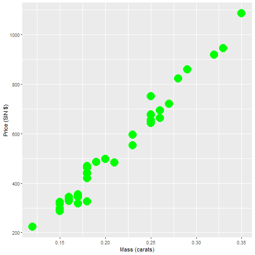

Developing Data Products - Course Project
========================================================
author: Raquel Lima Façanha
date:  September 11th, 2020 
autosize: true
transition: fade

Overview
========================================================

The shiny web application uses an example of regression 
for prediction explained in the book Regression Models for Data Science
in R by Brian Caffo (page 31).


Purpose of Application
========================================================

The shiny web application predicts the price of a diamond in Singapore
dollars based on diamond weight in carats using the diamond data set 
from UsingR package and a simple statistical linear regression model.


```
     carat            price       
 Min.   :0.1200   Min.   : 223.0  
 1st Qu.:0.1600   1st Qu.: 337.5  
 Median :0.1800   Median : 428.5  
 Mean   :0.2042   Mean   : 500.1  
 3rd Qu.:0.2500   3rd Qu.: 657.0  
 Max.   :0.3500   Max.   :1086.0  
```

Plotting Diamond Data
========================================================

Mass (carats) vs Price


Links to application and source code
========================================================

Shiny Web Application: https://rlfacanha.shinyapps.io/shinysimpleregression

GitHub: https://github.com/rlfacanha/developing_data_products
